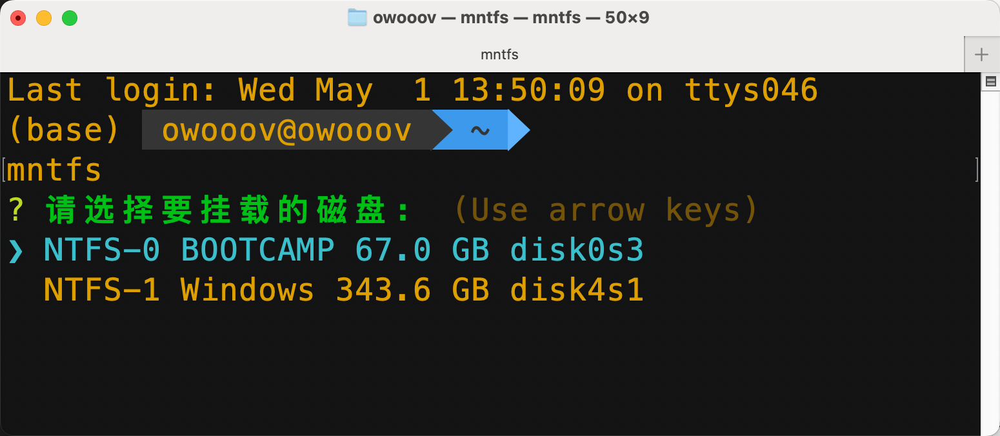
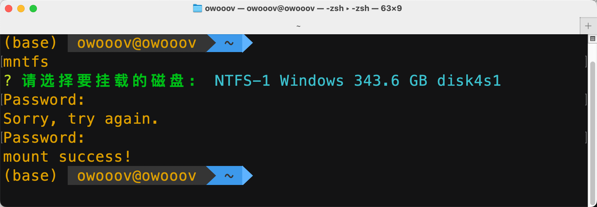

# Mntfs

Mntfs is a command-line tool based on macFUSE driver for mounting ntfs disks.

基于 macFUSE 驱动编写的简单易用的挂载 ntfs 磁盘的命令行工具。

### 安装使用

1. 安装[Home - macFUSE](https://osxfuse.github.io/)
2. 下载可执行程序（也可自行下载源码打包可执行程序）
3. 复制到 `/usr/local/bin`
4. 添加可执行权限（如有必要）
5. 打开终端输入 `mntfs`



5. 按上下键选择要挂载的磁盘，回车输入密码，回车确定完成挂载




6. 如果已挂载会显示（mounted）


7. 如果需要记住密码

   - 输入 `mntfs init`根据提示输入密码

   

   - 记录成功

   

8. 帮助

   ```bash
   mntfs - Mntfs is a command-line tool based on macFUSE driver for mounting ntfs disks
   
   usage: mntfs --init | --help | -V


   Options:
     init, --init                  Initialize and remember the administrator password for next use
     -h, --help                    display help message and exit
     -V, --version                 display version information and exit
   ```

开发环境配置

1. MacOS 系统
2. 依赖 macFUSE ntfs-3g 驱动 https://osxfuse.github.io/
3. Node18
4. 下载源码自己修改源码并打包

```sh
git clone https://github.com/owooov/mntfs.git
cd mntfs
   ```

```sh
pnpm install # 安装依赖
pnpm run pkg # 打包输出到./mntfs目录下

> mntfs@0.1.0 pkg /Volumes/MacOS/workspace/mntfs
> pkg -t node18-macos ./src/index.cjs -o ./mntfs/mntfs

> pkg@5.8.1
```

### 文件目录

eg:

```
├── LICENSE.txt
├── ReadMe.md
├── assets
├── package.json
├── pnpm-lock.yaml
└── src
    ├── api.js
    ├── config.js
    └── index.cjs
```

### 版权说明

该项目签署了 MIT 授权许可，详情请参阅 [LICENSE.txt](https://github.com/owooov/mntfs/blob/master/LICENSE.txt)
